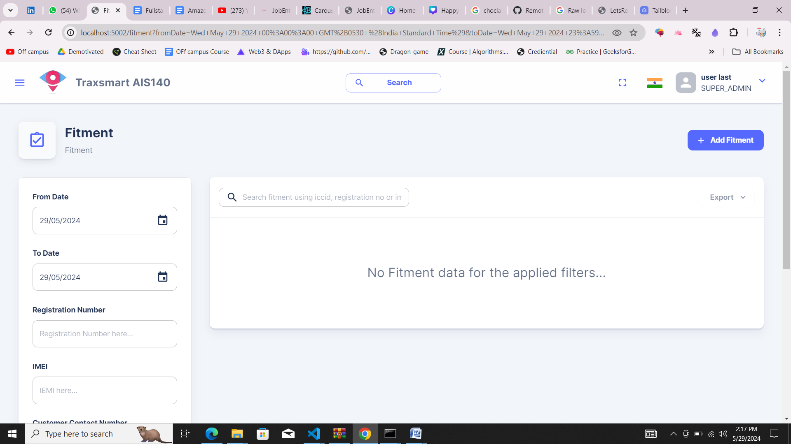

## Swim

The Swim project is actually   tracking up software for managing the traker setup how the customer will be tracked, how they purchase the product from the inventory, how the tracker software is tracked and how the product data will flow and how the product will pass from manufacturer  to inventory and customer.

The working is as

#  It has four subpart every part has another usage 
 <ol>
 <li>SuperAdmin</li>
 <li>manufacturer</li>
 <li>Inventory</li>
 <li>Customer</li>

 </ol>

# Lets See the working step-by-step.
  <h4>
   In the superAdmin , in the management/Organization, Super admin will create organization whether it is manufacturer, rfc , inventory, customer.
  </h4>
    <h4>
     In the manufacturer, the manufacturer will add the device details model number,UID,installation date etc.
    </h4>
    <h3>
     After the manufacturer will allocate the device to different inventory and inventory can be of different organizations and sub organizations.
    </h3>
     <h3>
     After the Inventory will allocate the device to the different rfc(retailers) which will fit the device in customer vehicle with all the customer details.
    </h3>
    <h4>
     After the Inventory will allocate the device to the different rfc(retailers) which will fit the device in customer vehicle with all the customer details.
    </h4>
     <h4>
     With the inventory Login,  the Inventory will allocate the device to the different rfc(retailers) which will fit the device in customer vehicle with all the customer details.
    </h4>
    <h4>
     Now after the device is fitted to customer vehicles, the customer will have a check whether the device will fit in that, and whether the customer details is stored in that or not, so customer wil have a login id which will verify by customer whether his details is updated or not.
    </h4>

# Table of Contents

1.Overview
2.Features and Panel!
3.Installation
4.Usage

## Overview

## This project is a solution to the vehicle Tracking by settting the device how it should goes from organization creation to the manufacturer and how the whole process become automated  from the old offline to whole  automation process , from  manufacturer to the delievery of software to the customer. 

## Features

1. Dashboard
   ## SuperAdmin
   <ol>
       <li>Vehicle Status </li>
       <li>Device</li>
       <li>Dashboard</li>
       <li>Fitment->Add Fitment</li>
       <li>Sim Activation Order->Sim ActivationForm<li>
       <li>Reports/Alert/Offline Report/Raw Logs/Summary/Vehicle TimeLine<li>
       <li>Management/Assets/Device/Device Model/Geo-Fence/Organisaton/Role/User<li>
   </ol>
2. Manufacturer
3. Inventory 
4. Customer

## Lets See Each Feature Step By Step:

# Dashboard

Vehicle Status : The vehicle status will show how many vehicles are moving , how many are of them are rest, how many of them are in parking, and how many of them are in offline.
In this the data is coming from the device  chip which will show the stats of the vehicle depending upon the filter on which the organization is  a part.

# Dashboard

Dashboard : The Dashboard will show how many device count is their, how many panic buttons , how many devic activation is initiated, and how many device has been approved.  

# Dashboard1

Dashboard : The Dashboard will show  the device status , how many fitment has been processed whether approved  initiated or rejected and how much activation has Expired or not , it will show how many stocks are there , and show rfc by statewise details  and what is the activation status of it and how many users or customer is allocated the device.  

Fitment Details  : It will show the fitment details in it and we can get the fitment .  

Fitment Form  : In this form, the fitment is created by putting different details in the form.

 Sim Activation  Order: It will show all the details of all the sims  dependinng upon different plans and we can assigns ips Imei and phone numer and activation duration on how much period we will activate the form. 

 Sim Activation Form :  Users Will fill up the IMEI, IPs , Phone number and Activation Duration.

 Alert Reports : It will show all the vehicle Real time  Reports in that  whether it is offline, online or somethings, 

Offline  Reports : It will show all the vehicle Real time  Reports in that  whether it is offline. 

Offline  Reports : It will show all the vehicle Real time  Reports in that  whether it is offline based of different filters like vehicle, IMEI, Offline Duration and  Organization.

Summary Report : It will show how much distance a vehicle will travel depending up the start time and end time, and how much  a distance will cover and how much energy is utilization from travelling a  distance  in some distance.

Summary Report : It will show how much distance a vehicle will travel depending up the start time and end time, and how much  a distance will cover and how much energy is utilization from travelling a  distance  in some distance.

Vehicle Timeline Report : It will show Vehicle Timeline Report (Chronological overview of vehicle trips and stop activity) , how much the timeline will show to the vehicle Duration.

Assets : It will show Vehicle name, Registration Number, Tracker IMEI,category belong to which organisation and when it is updated and added on and depending upon the filter we can search it on.

Vehicle Form : In this form, we will add the vehicle category, name , allot registration number , enginer number , chasis number , place  details, rto , owner details, organization details and  with show want to share.

Assets : It will show Vehicle name, Registration Number, Tracker IMEI,category belong to which organisation and when it is updated and added on and depending upon the filter we can search it on.

Device : It will show Device Details including UID ,IMEI, ICCID,Model,Mission, Organization and Acivated or sim activation date and sim activation status and we can search it on using different filters. 

Device Form : In this form , we will add all the details of the device including all the detais  like IMEI, Installation Date, TAC , Sim Details, Sim Operator,  ICCID, Operator and manufacturer.

Device Model : It will list all the details of the device (List of all the device models on your device) including their name,firmware, protocols ,availability and actions.

Device Form : Here we can fill up the device detail including  model name , description, firmwares ,protocols and its availability.

GeoFence : Here we can got geofence data on selected filter and it has a form attached where we can add  geofence data

Organization Board : Here we can see all the organization  that were listed and that we are created.

Organization Form : In thi we can create differene organizations including their tradename, brand name, contact, type aand Gst and  other details 

Roles : Here we can see all the roles  that were listed and that we are created and how much permission is alloted to them. 

Role Form : In this we can give access to the permissions what user which permission will be given to each user , what task it will perform depending upon the user view. 

Roles : Here we can see all the roles  that were listed and that we are created and how much permission is alloted to them. 

Role Form : In this we can give access to the permissions what user which permission will be given to each user , what task it will perform depending upon the user view. 

Users : Here we can see  the users details including their first name, lastname, phone number, email, status and when the account is created. 

Users Form : In this we can fill all the details of the users. 

Users : Here we can see  the users details including their first name, lastname, phone number, email, status and when the account is created. 

Users Form : In this we can fill all the details of the users. 

